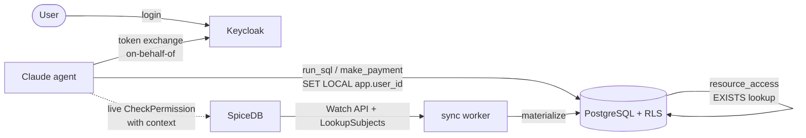

# Authorizing AI agents with a user's own permissions

**Type:** Architecture / pattern reference
**Owner:** Richard Kooijman
**Status:** Working reference implementation (demo)
**Last updated:** 2026-08-03
**Repo:** https://github.com/Bartman0/agents-authorisation
**Canonical source:** `docs/agent-authorization-architecture.md` in the
`agents-authorisation` repo. Any wiki copy is a mirror for discoverability —
**edit the repo file, not the wiki page.**

---

## TL;DR

When an AI agent acts for a person, it must be able to do **only what that person
can do — and often less**. This is a runnable pattern for exactly that:

- **SpiceDB** is the source of truth for authorization (relationships + policy).
- A sync worker **materializes** SpiceDB's decisions into a Postgres table.
- **Postgres Row Level Security (RLS)** enforces them on every query — one indexed
  lookup, no per-query call to SpiceDB, and impossible to bypass from the app.
- **Keycloak** authenticates the user and, via **token exchange**, issues the agent
  a *delegated, fit-for-purpose* token that acts on the user's behalf.
- A **Claude agent** answers questions and performs actions strictly inside that
  boundary.

The agent's effective authority is the **intersection** of five independently
enforced dimensions:

```
effective access =  WHO         (SpiceDB relationships → materialized RLS on the user's identity)
                 ∩  OPERATION   (read vs write — OAuth scope → DB role + READ ONLY tx)
                 ∩  SERVICE     (which backend — per-service client + token audience)
                 ∩  CONDITION   (e.g. "pay ≤ €X" — SpiceDB caveat → materialized limit + live check)
                 ∩  SESSION     (this session's purpose — Keycloak Authorization-Services policy)
```

The key property: **even a fully compromised or prompt-injected agent cannot read
or change data the invoking user isn't entitled to**, because enforcement lives in
the database and the identity provider, not in the agent's good behavior.

---

## The problem

Giving an LLM agent direct database or API credentials is dangerous: the agent (or
a prompt injection) can then do anything those credentials allow. We want the agent
to inherit the *user's* authority, scoped down to the specific task — read-only,
one service, bounded amounts — and we want that enforced by infrastructure, not by
trusting the model.

Two things have to be true at once:

1. **Expressive policy.** Real authorization is relational (ownership, delegation,
   org-wide auditors, spending limits). SpiceDB (a Zanzibar implementation) models
   this well.
2. **Efficient, unbypassable enforcement.** Calling SpiceDB per row is slow, and
   enforcement in application code can be bypassed. Postgres RLS is cheap and
   absolute.

This pattern gets both by keeping SpiceDB authoritative and **projecting** its
computed permissions into Postgres, where RLS enforces them.

---

## Architecture



**Components**

| Component | Role |
|---|---|
| PostgreSQL | Business data + RLS enforcement point |
| Keycloak | Identity provider; user login + on-behalf-of token exchange |
| SpiceDB | Authoritative authorization model (relationships, permissions, caveats) |
| sync worker | Tails SpiceDB's Watch API, materializes permissions into Postgres |
| Claude agent | Tool-calling agent; each tool is a "backend service" behind the boundary |

The demo domain is **financial**: an organization owns accounts; accounts have
transactions; users are owners, delegates, or org auditors.

---

## Identity: acting on behalf of the user

1. **User login.** The user authenticates to Keycloak (demo uses a direct-access
   grant; in production this is a normal browser login). Their `sub` (a stable
   UUID) is the identity everything keys on — the *same* UUID is used as the
   SpiceDB `user` object id and the Postgres `app.user_id`, so identity is
   consistent across all three systems.

2. **Token exchange (RFC 8693).** Per task, the agent performs a token exchange,
   presenting the user's token as the `subject_token`, and receives a **delegated**
   token whose `sub` is still the user and whose `azp` is the acting agent client.
   The agent cannot escalate to its own identity to widen access.

3. **Just-in-time (JIT) minting.** The user token is obtained once per session;
   then *every tool call* mints a fresh, short-TTL (120s) token scoped to just that
   call. This shrinks the blast radius if a token leaks mid-session.

4. **Per-service clients.** Each backend service trusts its own Keycloak client
   (`finance-agent-transactions`, `finance-agent-payments`). Keycloak caps what each
   client may request, so a client for one service **cannot mint a token for
   another** (`invalid_scope`) — service isolation is enforced by the IdP.

---

## The core pattern: SpiceDB → Postgres RLS materialization

SpiceDB defines *who can do what*. But we don't want a gRPC round-trip per row. So a
**sync worker**:

- On startup and on every **Watch API** event, for each materialized
  `(resource_type, permission)` pair, calls SpiceDB `LookupSubjects` to get the
  exact set of subjects holding that permission on each resource.
- Upserts the result into a Postgres table:

  ```
  resource_access(subject_id, resource_type, resource_id, permission, max_amount)
  ```

RLS policies then do nothing but look for a matching row:

```sql
CREATE POLICY account_view ON accounts FOR SELECT USING (
  EXISTS (SELECT 1 FROM resource_access ra
          WHERE ra.resource_type = 'account'
            AND ra.resource_id   = accounts.id::text
            AND ra.permission    = 'view'
            AND ra.subject_id    = current_setting('app.user_id', true)));
```

The agent sets `app.user_id` (via `SET LOCAL`) from the delegated token's `sub` at
the start of each transaction. If it's unset, `current_setting(..., true)` returns
NULL and every policy denies — **secure by default**.

**Why this is safe.** The agent connects as a non-privileged Postgres role with **no
`BYPASSRLS`**. RLS is therefore a hard boundary the agent cannot cross regardless of
what SQL the LLM generates — the backstop against prompt injection.

---

## The five authorization dimensions

| Dimension | Defined in | Carried by | Enforced by |
|---|---|---|---|
| **Who** | SpiceDB relationships | delegated token `sub` | materialized RLS on `app.user_id` |
| **Operation** (read/write) | tool → scope mapping | `finance:read` / `finance:write` | DB role (`agent` SELECT-only vs `agent_writer`) + `READ ONLY` tx + per-command RLS (`view` vs `manage`) |
| **Service** (which backend) | per-service Keycloak client | `svc:transactions` / `svc:payments` scope → token `aud` | Keycloak (`invalid_scope`) + resource-server `aud` check |
| **Condition** (e.g. pay ≤ €X) | SpiceDB caveat | relationship-bound caveat context | materialized `max_amount` in RLS `WITH CHECK` + live `CheckPermission` |
| **Session** (this session's purpose) | Keycloak Authorization Services | `session_purpose` claim on the user token | UMA policy decision (`payment#execute` requires `session_purpose == readwrite`) |

Each is enforced independently; the agent can do only what survives **all five**.

### Who
The SpiceDB schema:

```
definition account {
    relation parent:   organization
    relation owner:    user
    relation delegate: user
    relation limited_payer: user with within_limit

    permission view   = owner + delegate + parent->audit
    permission manage = owner
    permission pay    = owner + limited_payer
}
```
Owners/delegates/auditors can `view`; owners can `manage`; owners + (caveated)
limited payers can `pay`.

### Operation
The tool's OAuth scope maps to a DB role and transaction mode:
- `finance:read` → connect as `agent` (SELECT-only), `READ ONLY` transaction.
- `finance:write` → connect as `agent_writer` (SELECT + DML).
RLS uses per-command policies: `FOR SELECT` requires `view`, `FOR UPDATE/DELETE`
requires `manage`. So an auditor (view-all, manage-none) can read everything and
change nothing.

### Service
Reads go through a `transactions-service`, payments through a `payments-service`.
Each service has its own Keycloak client that can only mint its own service's
scopes; the token's `aud` names exactly one service, and each service (resource
server) checks its `aud`. A transactions token is refused by the payments service.

### Condition (caveats) — the hard part
See "Conditional access" below.

### Session
The per-client ceiling can't say "this session is read-only" — the payments
client can always mint a write token. A Keycloak Authorization-Services policy
adds a *per-session* ceiling keyed on a signed `session_purpose` claim. See
"Per-session authorization ceiling" below.

---

## Conditional access: SpiceDB caveats vs the materialization model

A **caveat** makes a grant conditional on runtime context:

```
caveat within_limit(amount double, max_amount double) { amount <= max_amount }
```

Example: Alice is a `limited_payer` on Bob's account bound with `max_amount = 500`,
so she may pay from it **but only up to €500**; Bob (owner) pays any amount.

This is the case that **stresses the materialization model**: a caveat's answer
depends on runtime context (the amount), so you can't pre-compute a boolean into
`resource_access`. Three ways to handle it:

1. **Materialize the parameter, enforce in RLS (used here).** This caveat's
   variable (`amount`) is a *column of the row being written* and its parameter
   (`max_amount`) is static. So the sync worker reads the bound limit (via
   `ReadRelationships`) into `resource_access.max_amount`, and the RLS `INSERT ...
   WITH CHECK` enforces `max_amount IS NULL OR abs(amount) <= max_amount`. No
   per-payment gRPC; still a hard DB boundary.

2. **Live check for precise reasons (also used here).** A generic RLS violation
   can't say *why* (no grant vs over-limit). So the payments service also calls
   SpiceDB `CheckPermission` **with the amount in context** to produce an
   explainable decision before the RLS-guarded write still enforces it.

3. **Live check as sole enforcement (when pushdown is impossible).** If the
   caveat's context isn't a column of the written row (e.g. "only on weekdays",
   "only if an external risk score is low"), you can't materialize it — the live
   `CheckPermission` becomes the enforcement on the write path, while
   materialization still serves the fast read path.

**Rule of thumb:** *materialize what's static (fast, unbypassable); check live what's
dynamic (authoritative, explainable).*

---

## Per-session authorization ceiling (Keycloak Authorization Services)

The four dimensions above put the **operation ceiling on the client**:
`finance-agent-transactions` is never assigned `finance:write`, so it can't mint a
write token. Strong, but *per client* — it can't express "**this session** may only
read, even though it runs on a write-capable client." The payments client can
always mint write.

The fifth dimension makes the write ceiling a **per-session decision, evaluated by
Keycloak's policy engine** against an un-forgeable session claim.

**1. A signed session-purpose claim.** At session start (the delegation boundary)
the user token is minted carrying `session_purpose` = `read` | `readwrite`,
stamped by Keycloak via a requested purpose scope (`purpose:read` /
`purpose:readwrite`, each with a hardcoded-claim mapper). It is signed — the agent
cannot alter it after login.

**2. A Keycloak Authorization-Services policy on the payments client.** The
payments client is a resource server with:

```
finance-agent-payments  (authorizationServicesEnabled = true)
├─ resource:   payment
├─ scope:      execute
├─ policy:     session-is-readwrite     (Regex claim policy: session_purpose == "readwrite")
└─ permission: payment#execute  requires  session-is-readwrite
```

**3. Evaluation at the action.** Before executing a payment, the payments service
asks Keycloak to decide, presenting the **user token** (which carries
`session_purpose` and already lists the payments client in its `aud`):

```
POST {token endpoint}
  grant_type    = urn:ietf:params:oauth:grant-type:uma-ticket
  audience      = finance-agent-payments
  permission    = payment#execute
  response_mode = decision
  Authorization: Bearer {user token}
→ 200 {"result": true}          ⇒ allow
→ 403 {"error":"access_denied"} ⇒ deny (session is read-only)
```

Keycloak runs the policy against `session_purpose`. A read-only session is denied —
centrally, dynamically, per session — **even on the write-capable payments client**.

**Why the user token, not the delegated token.** Token exchange re-mints a fresh
token for the target client, so a login claim isn't automatically present in the
delegated token. The user (login) token reliably carries `session_purpose`, is held
by the trusted orchestrator, and already has `finance-agent-payments` in its `aud`
(portal audience mapper), so it's a valid requesting-party token. DB write authority
still comes from the delegated token's `sub`; both share the same `sub`/`sid`.

**How it layers (defense in depth).**

```
per-CLIENT scope allowance   (static floor)   — a read client cannot mint write at all
per-SESSION UMA policy        (dynamic ceiling) — a read SESSION is denied write even on a write-capable client
SpiceDB caveat (amount)       — pay ≤ limit
RLS INSERT ... WITH CHECK     — unbypassable DB backstop
```

**Honest limitation (demo vs production).** *Who sets `session_purpose`,
un-forgeably?* In production the user's delegation/consent step decides it and
Keycloak stamps it; a stricter binding could use a **User Session Note** set by a
custom authenticator SPI (survives token exchange because the `sid` is shared). In
this single-process demo the orchestrator picks purpose at session-start login
(tied to `--allow-write`) — the same trust boundary as `--allow-write`, but now the
decision is a signed claim enforced by Keycloak's policy engine at action time, so
it is central, auditable, dynamically changeable, and cannot be escalated later in
the session without a fresh login. (Keycloak has no admin API to set a session note
directly; the requested-scope claim is the no-SPI stand-in.) One extra Keycloak
round-trip per payment; the read path is untouched.

---

## Trade-offs & operational notes

- **Eventual consistency.** Materialization means a brief lag between a change in
  SpiceDB and its enforcement in Postgres (bounded by a Watch event + one reconcile;
  sub-second in the demo). For operations needing strong consistency, check SpiceDB
  directly on the write path.
- **Reconcile granularity.** The demo re-reconciles fully on any change (trivial at
  demo scale). At scale, reconcile only affected resources from the Watch payload.
- **Datastore.** The demo runs SpiceDB on the in-memory datastore (ephemeral;
  schema + relationships are re-seeded on startup). Production uses the Postgres or
  Spanner datastore.
- **Token exchange (Keycloak 26.2+).** Standard token exchange is enabled per client
  via `standard.token.exchange.enabled`. The requesting client must be in the
  subject token's `aud` (handled by an audience mapper on the login client), and the
  exchange must request **no** `audience` param so the token is minted for the
  requesting client.
- **Scope registration.** `finance:*` / `svc:*` scopes are registered at runtime via
  the admin API rather than in the realm import, because declaring `clientScopes` in
  an import replaces Keycloak's built-in default scopes.

---

## Security properties

- **Prompt-injection resistant.** The agent has no privileged DB role and no
  `BYPASSRLS`; RLS filters every read and gates every write. A hijacked agent asking
  to "dump all accounts" gets only the user's rows.
- **Least privilege by construction.** JIT, short-TTL, per-service, per-operation
  tokens mean a leaked credential is narrow and stale.
- **Consistent identity.** One UUID across Keycloak, SpiceDB, and Postgres removes a
  common class of mapping bugs.
- **Defense in depth.** Service access is enforced twice (Keycloak client cap +
  resource-server `aud`); payment limits twice (materialized RLS + live check); the
  write ceiling twice (per-client scope floor + per-session Keycloak policy).

---

## Running the reference implementation

```bash
cp .env.example .env          # add ANTHROPIC_API_KEY
docker compose up -d --build

# No API key needed — prove each dimension:
./demo-rls.sh                 # identity → view scoping
./demo-permission-change.sh   # a SpiceDB grant/revoke propagating to RLS (sub-second)
./demo-scoped-tokens.sh       # operation + service dimensions, per-service client isolation
./demo-caveat.sh              # caveat (pay-limit): SpiceDB verdict vs RLS outcome, side by side
./demo-transfers.sh           # transfers + a live permission change, logging every token used
./demo-session-purpose.sh     # per-session write ceiling (Keycloak Authorization Services)

# With a key — the live Claude agent:
docker compose run --rm agent --user bob --password bob --allow-write \
  --ask "Show my balances, then pay 250 EUR from my business account to KPN for 'Internet'."

# The per-session ceiling live: payments tool exposed, but a read-only session is denied.
docker compose run --rm agent --user bob --password bob --allow-write --session-purpose read \
  --ask "Pay 50 EUR from my business account to KPN."
```

Demo users: `alice` (owns 1,2; delegate + ≤€500 payer on 3), `bob` (owns 3),
`carol` (owns 4), `dave` (org auditor — reads all, changes nothing).

---

## Repo map

```
docker-compose.yml         all services
postgres/init/             schema, RLS policies (view / manage / pay), seed data
keycloak/realm-export.json realm, clients, users (fixed UUIDs)
keycloak/init.py           one-shot: register operation/service/purpose scopes; payments authz
spicedb/schema.zed         authoritative model (relations, permissions, caveat)
sync/                      bootstrap, Watch→Postgres worker, relctl, check
agent/                     Claude agent: JIT scoped identity, DB access, spicedb + authz checks, tools
FIXTURES.md                identity mapping shared by all three systems
demo-*.sh                  runnable proofs of each dimension
docs/per-session-authorization.md   deeper design note for the session dimension
```

---

## Open questions / future work

- **Read-side caveats** (e.g. "EUR accounts only") — a data-subset filter on reads,
  analogous to the pay-limit on writes.
- **Per-resource reconcile** driven by the Watch payload, for scale.
- **Strong-consistency writes** — decide which operations must check SpiceDB live
  rather than trust the materialized projection.
- **Generalizing beyond finance** — the pattern is domain-agnostic; the only
  domain-specific parts are the SpiceDB schema and the RLS policies.
